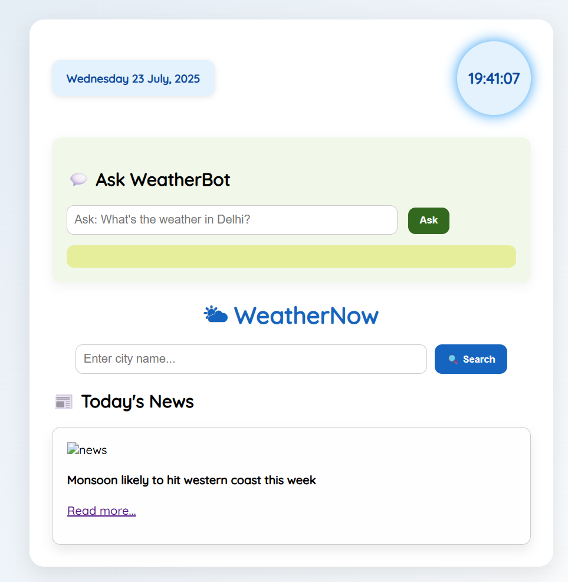

# 👋 Hi, I'm Niranjan Surve

## 👨‍💻 About Me

I’m **Niranjan Surve**, a passionate **MCA student** exploring the world of **web development**, **API integration**, and **network security**. I enjoy turning complex problems into smart, user-friendly solutions.

🔧 **Skills I focus on:**
- Frontend: HTML5, CSS3, JavaScript
- Backend: PHP, MySQL
- APIs: OpenWeatherMap, News API, OpenAI
- Networking: OSI model, TCP/IP, Web security
- Tools: VS Code, GitHub, XAMPP, .NET

🌱 I’m currently learning:
- AI/ML for Smart Apps
- Secure Web Architecture
- Cloud Deployment
- Big Data Analysis
- Android Development

💬 Ask me about:
- Building smart web apps
- Weather forecasting projects
- Hosting PHP apps locally

📈 My goal: To build intelligent, secure, and scalable web solutions that can help businesses or users make better real-time decisions.

---

# 🌤 WeatherNow

**Smart Weather Forecast App** built using PHP, OpenWeatherMap API, and JavaScript. This app provides real-time weather data, forecasts, weather-based backgrounds, and even an AI-based chatbot for asking natural weather queries.

## 🔧 Features
- https://www.linkedin.com/posts/activity-7353442777940041729-A8aO?utm_source=share&utm_medium=member_desktop&rcm=ACoAAFSmeXkB_gUY8_va01JAixsop7xnvTqBnuo
- 🌐 Real-time weather updates
- 📅 5-day forecast with icons & temperatures
- 🤖 AI Chatbot for natural language weather questions
- 📰 Weather-related news updates
- 🌈 Dynamic background change based on weather
- 🔒 Secure backend using PHP session handling

## 🚀 Technologies Used

- PHP
- HTML, CSS, JavaScript
- OpenWeatherMap API
- News API
- OpenAI API (for chatbot)

## 📸 Screenshots

---

## 📬 Contact Me

- 📛 Name: Niranjan Surve  
- 📧 Email: niranjan@example.com  
- 💼 GitHub: [@niranjansurve](https://github.com/niranjansurve)  
- 🔗 LinkedIn: [linkedin.com/in/your-profile](https://linkedin.com/in/your-profile)

---

> *Thanks for visiting my profile! Feel free to check out my project and connect with me!* 🚀

