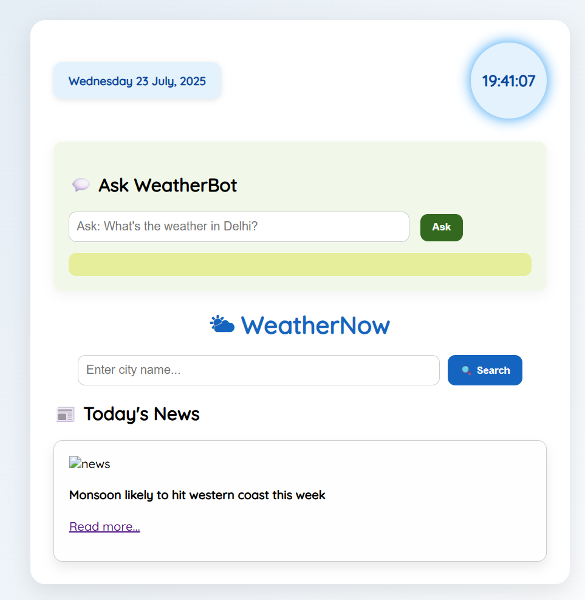

# 🌤 WeatherNow

**Smart Weather Forecast App** built using PHP, OpenWeatherMap API, and JavaScript.

## 🔧 Features

- 🌐 Real-time weather updates
- 📅 5-day forecast with icons
- 🔍 AI Chatbot weather search
- 📰 Live weather-related news
- 🎵 Background music
- 🌈 Dynamic background change by weather
- 🔒 Secure backend with PHP

## 🚀 Technologies Used

- PHP
- HTML, CSS, JavaScript
- OpenWeatherMap API
- News API
- OpenAI Chat Integration (Optional)

## 📸 Screenshots

## 📁 How to Run

1. Clone this repo
2. Add your API keys in `weather_api.php`
3. Run on localhost using XAMPP/WAMP

## 📩 Contact

- Name: Niranjan Surve
- Email: niranjan@example.com
- GitHub: [@niranjansurve](https://github.com/niranjansurve)

---
